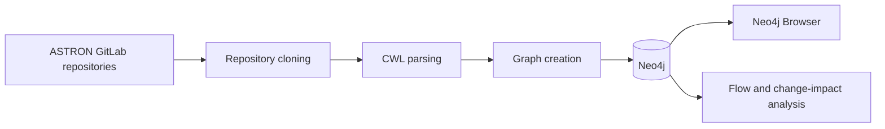

# PiVoT 
**Pi**peline dependencies **V**isualizati**o**n **T**ool --  PiVoT 

PiVoT is a framework that can extract data dependencies from a repository containing CWL files.

PiVoT turns Common Workflow Language (CWL) workflows into a queryable dependency graph. It discovers workflow inputs, outputs, nested steps, and the relationships between them, then stores that structure in Neo4j for exploration and further analysis.

## What it does

- Clones the configured ASTRON GitLab repositories for processing.
- Recursively finds and parses `.cwl` files.
- Represents CWL components and parameters as Neo4j nodes.
- Creates `DATA_FLOW`, `CONTROL_DEPENDENCY`, and repository `REFERENCES` relationships.
- Preprocesses the graph so that dependencies can be inspected in Neo4j Browser.
- Includes research code for flow-path calculation, change-impact scoring, and historical co-change comparison.

The current default run builds and preprocesses the graph. The change-impact analysis call in `main.py` is commented out, so the analysis outputs described below are produced only when that workflow is enabled separately.

## Architecture



The main modules are organized around this pipeline:

| Area | Responsibility |
| --- | --- |
| `process_gitlab/` | Clone repositories and collect commit history for evaluation. |
| `graph_creation/` | Parse CWL and Docker-related files and translate them into graph entities. |
| `neo4j_graph_queries/` | Create, remove, and query graph nodes and relationships. |
| `graph_analysis/` | Preprocess dependency subgraphs and calculate information-flow paths and impact scores. |
| `metric_evaluation/` | Compare change-impact results with historical co-change data. |

## Requirements

- Docker Desktop with Docker Compose
- Git (for cloning the repository)

The Docker image installs the Python dependencies from `requirements.txt`. A local virtual environment is useful when developing or running individual modules.

## Quick start with Docker

Clone the repository. From the repository root:

```bash
docker compose up --build
```

This starts the processor container and a Neo4j server. Neo4j Browser is available at <http://localhost:7474> and the Bolt endpoint is exposed at `bolt://localhost:7687`.

The default Neo4j login configured by Docker Compose is:

```text
username: neo4j
password: your_new_password
```

Change this value in `docker-compose.yml` before using the project outside a local development environment. The same password must be used for `NEO4J_PASSWORD` and `NEO4J_AUTH`.

The graph can be created from the processor container as follows:

```bash
docker compose run -it cwl_processor
```

This starts the Docker service with all dependencies required by the project and opens a shell inside the container. From that shell, run the following command to initiate graph creation. You can interact with and query the resulting graph through Neo4j Browser at <http://localhost:7474> or through the Bolt endpoint at `bolt://localhost:7687`.

```bash
python3 main.py
```

To exit the container, use:

```bash
exit
```

To stop the Docker services:

```bash
docker compose down --remove-orphans
```

Depending on your Docker and system configuration, ports `7474` and `7687` may be occupied, preventing the Neo4j service from starting. On Unix-like systems, identify the processes using those ports with:

```bash
sudo lsof -i :7474,7687
```

You can then terminate the processes occupying those ports with:

```bash
sudo kill -9 <PIDs separated by spaces>
```


## Configuration

Neo4j connection settings are read from environment variables by `main.py`:

| Variable | Default | Description |
| --- | --- | --- |
| `NEO4J_URI` | `bolt://localhost:7687` | Neo4j Bolt URI. Docker Compose overrides this with the service hostname. |
| `NEO4J_USERNAME` | `neo4j` | Neo4j username. |
| `NEO4J_PASSWORD` | `your_new_password` | Neo4j password. |

The list of repositories to clone is currently defined in `main.py` under `relevant_repos`. Update that list when processing a different set of ASTRON projects.

## Graph model

PiVoT uses these principal node labels:

- `Component`: a CWL file or component, identified by its repository-relative path.
- `InParameter`: an input belonging to a component.
- `OutParameter`: an output belonging to a component.
- `Git`: a referenced Git repository.

Relationships describe how information moves through the workflow:

- `DATA_FLOW` connects a source parameter to its destination parameter or component.
- `CONTROL_DEPENDENCY` captures dependencies created by workflow control expressions such as `when`.
- `REFERENCES` connects a component with a referenced Git repository.

## Generated data

When the analysis routines are enabled, PiVoT writes these files in the repository root:

| File | Contents |
| --- | --- |
| `flow_paths.json` | Information-flow paths between components. |
| `change_impact_analysis.csv` | Component coupling/change-impact matrix. |
| `change_impact_cumulative_scores.json` | Cumulative impact scores grouped by repository. |
| `history_percent.csv` | Co-change percentages used for evaluation. |

Commit fixtures used by the evaluation workflow are kept under `commit_data/`.

## Local development

Create an isolated environment and install the dependencies:

```bash
python3 -m venv .venv
source .venv/bin/activate
python -m pip install -r requirements.txt
```

Neo4j must be running before a local Python process can connect to it. Set the connection variables for the local endpoint, then run:

```bash
export NEO4J_URI=bolt://localhost:7687
export NEO4J_USERNAME=neo4j
export NEO4J_PASSWORD=your_new_password
python main.py
```

The processing run clears the existing graph, clones the configured repositories into a temporary `repos/` directory, imports their CWL data, prints graph-size information, and removes the cloned repositories during cleanup.

## Research context

PiVoT supports the dependency representation and change-impact analysis described in the master thesis *Representing dependencies and performing change impact analysis in the ASTRON ecosystem of CWL workflows*. The implementation separates graph construction from downstream analysis so that the dependency representation can be explored independently in Neo4j.

## Project status

This repository is a research prototype. The default graph-import path is the primary supported workflow; the analysis pipeline and some integrations remain under active development. Before running against shared data, review the repository list, Neo4j credentials, and the graph-clearing behavior in `main.py`.

## Contributing

Small, focused changes are welcome. When contributing:

1. Keep parsing, graph queries, and analysis logic in their existing modules.
2. Document new environment variables or generated files here.
3. Verify changes against a local Neo4j instance or the Docker Compose stack.

## License

No license file is currently included. Confirm the intended license with the project maintainers before redistributing the code.
